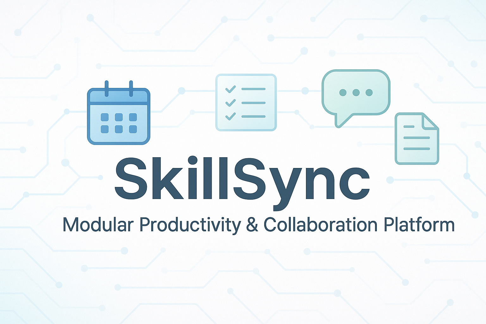

#  [](https://www.docker.com/)


# skillsync-core

Primary backend API combining Auth, User Management, RBAC, and Project Management.

---

## Table of Contents
- [Docker Support](#docker-support)
- [Features](#features)
- [Installation](#installation)
- [Configuration](#configuration)
- [Usage](#usage)
- [Pub/Sub Topics](#pubsub-topics)
  - [Published Topics](#published-topics)
  - [Subscribed Topics](#subscribed-topics)
- [Project Structure](#project-structure)
- [Testing](#testing)
- [Contributing](#contributing)
- [License](#license)
- [Contact](#contact)

---

## Docker Support

This service is fully containerized and ready to run in Docker.

### Run Locally with Docker Compose

1. Ensure Docker and Docker Compose are installed on your machine.
2. In the root of the project, build and run containers with:

   ```bash
   docker-compose up --build
   ```

This will:
- Boot the `skillsync-core` backend inside a container

### Ports

- `3000`: `skillsync-core` API

### Notes
- You can inspect logs using:

  ```bash
  docker-compose logs -f
  ```

- The app logs will confirm Pub/Sub topic setup and server boot success.


## Features
- **Authentication**: Secure user authentication with token-based mechanisms.
- **User Management**: CRUD operations for user profiles and roles.
- **RBAC (Role-Based Access Control)**: Fine-grained access control for resources.
- **Project Management**: Tools for managing projects, tasks, and team collaboration.
- **Pub/Sub Integration**: Seamless communication with other services via message topics.
- **Firestore Integration**: Robust data storage and retrieval using Google Firestore.


---

## Installation
1. Clone the repository:
   ```bash
   git clone https://github.com/your-username/skillsync-core.git
   cd skillsync-core
   ```
2. Install dependencies:
   ```bash
   npm install
   ```
3. Set up the environment variables:
   - Create a `.env` file in the root directory.
   - Add the required variables (see [Configuration](#configuration)).

4. Start the server:
   ```bash
   npm start
   ```

---

## Configuration
The application uses a `.env` file to manage environment variables. These must be set before running the service.

You can copy `.env.local.example` as a starting point and fill out the values:

```bash
cp .env.template .env
```

**Required Variables:**

- `APP_HOST`: The host interface the app binds to (e.g., `0.0.0.0`)
- `APP_PORT`: The port on which the server listens (e.g., `3000`)
- `LOG_LEVEL`: Logging verbosity (e.g., `info`, `debug`)
- `GCP_PROJECT_ID`: Your Google Cloud project ID
- `GOOGLE_APPLICATION_CREDENTIALS`: Path to your GCP service account credentials JSON

**Example `.env` file:**

```env
APP_HOST=0.0.0.0
APP_PORT=3000
LOG_LEVEL=info

GCP_PROJECT_ID=skillsync-459118
GOOGLE_APPLICATION_CREDENTIALS=./credentials/skillsync-creds.json
```

---

## Usage
Once the server is running, you can interact with the API using tools like Postman or cURL. Example endpoints:

- **Authentication**:
  - `POST /auth/login`: Log in a user.
  - `POST /auth/register`: Register a new user.
- **User Management**:
  - `GET /users`: Fetch all users.
  - `PUT /users/:id`: Update a user profile.

---

## Pub/Sub Topics

### Published Topics

1. **`user.created.response`**
   - **Description**: Response after a user is successfully created.
   - **Message**:
     ```json
     {
       "correlationKey": "string",
       "status": true,
       "id": "string",
       "message": "string"
     }
     ```

2. **`user.updated.response`**
   - **Description**: Response after a user is updated.
   - **Message**:
     ```json
     {
       "correlationKey": "string",
       "status": true,
       "id": "string",
       "message": "string"
     }
     ```

3. **`user.deleted.response`**
   - **Description**: Response after a user is deleted.
   - **Message**: Same as above.

4. **`project.created.response`**
   - **Description**: Response after a project is created.
   - **Message**: Same as user responses.

5. **`project.updated.response`**
   - **Description**: Response after a project is updated.
   - **Message**:
     ```json
     {
       "correlationKey": "string",
       "status": true,
       "id": "string",
       "message": "string",
       "updatedFields": {
         "name": "string",
         "description": "string"
       }
     }
     ```

6. **`project.deleted.response`**
   - **Description**: Response after a project is deleted.
   - **Message**: Same as user responses.

7. **`task.created.response`**
   - **Description**: Response after a task is created.
   - **Message**: Same as user responses.

8. **`task.updated.response`**
   - **Description**: Response after a task is updated.
   - **Message**:
     ```json
     {
       "correlationKey": "string",
       "status": true,
       "id": "string",
       "message": "string",
       "data": {
         "description": "string",
         "taskMembers": ["string"],
         "dueDate": "string",
         "status": "string"
       }
     }
     ```

9. **`task.deleted.response`**
   - **Description**: Response after a task is deleted.
   - **Message**: Same as user responses.

10. **`task.assigned.response`**
    - **Description**: Response after a task is assigned to a member.
    - **Message**:
      ```json
      {
        "correlationKey": "string",
        "status": true,
        "id": "string",
        "message": "string",
        "data": {
          "taskMembers": ["string"]
        }
      }
      ```

11. **`task.completed.response`**
    - **Description**: Response after a task is marked complete.
    - **Message**:
      ```json
      {
        "correlationKey": "string",
        "status": true,
        "id": "string",
        "message": "string",
        "data": {
          "completedBy": "string",
          "status": "string"
        }
      }
      ```

---

### Subscribed Topics

1. **`user.created.request`**
   - **Description**: Request to create a user.
   - **Message**:
     ```json
     {
       "correlationKey": "string",
       "id": "string",
       "email": "string",
       "name": "string"
     }
     ```

2. **`user.updated.request`**
   - **Description**: Request to update a user.
   - **Message**:
     ```json
     {
       "correlationKey": "string",
       "id": "string",
       "email": "string",
       "name": "string"
     }
     ```

3. **`user.deleted.request`**
   - **Description**: Request to delete a user.
   - **Message**:
     ```json
     {
       "correlationKey": "string",
       "id": "string"
     }
     ```

4. **`project.created.request`**
   - **Description**: Request to create a project.
   - **Message**:
     ```json
     {
       "correlationKey": "string",
       "id": "string",
       "name": "string",
       "description": "string"
     }
     ```

5. **`project.updated.request`**
   - **Description**: Request to update a project.
   - **Message**:
     ```json
     {
       "correlationKey": "string",
       "id": "string",
       "name": "string",
       "description": "string"
     }
     ```

6. **`project.deleted.request`**
   - **Description**: Request to delete a project.
   - **Message**:
     ```json
     {
       "correlationKey": "string",
       "id": "string"
     }
     ```

7. **`task.created.request`**
   - **Description**: Request to create a task.
   - **Message**:
     ```json
     {
       "correlationKey": "string",
       "id": "string",
       "projectId": "string",
       "name": "string",
       "description": "string",
       "taskMembers": ["string"],
       "dueDate": "string",
       "status": "string"
     }
     ```

8. **`task.updated.request`**
   - **Description**: Request to update a task.
   - **Message**:
     ```json
     {
       "correlationKey": "string",
       "id": "string",
       "name": "string",
       "description": "string",
       "dueDate": "string",
       "status": "string"
     }
     ```

9. **`task.deleted.request`**
   - **Description**: Request to delete a task.
   - **Message**:
     ```json
     {
       "correlationKey": "string",
       "id": "string"
     }
     ```

10. **`task.assigned.request`**
    - **Description**: Request to assign a task to a user.
    - **Message**:
      ```json
      {
        "correlationKey": "string",
        "id": "string",
        "memberId": "string"
      }
      ```

11. **`task.completed.request`**
    - **Description**: Request to mark a task as complete.
    - **Message**:
      ```json
      {
        "correlationKey": "string",
        "id": "string",
        "completedBy": "string"
      }
      ```

---

## Project Structure
```
skillsync-core/
├── src/
│   ├── auth/          # Authentication module
│   ├── users/         # User management module
│   ├── projects/      # Project management module
│   ├── pubsub/        # Pub/Sub integration
│   └── utils/         # Utility functions
├── tests/             # Unit and integration tests
├── .env               # Environment variables
├── package.json       # Node.js dependencies
└── README.md          # Project documentation
```

---

## Testing

This project uses **Jest** for unit and integration tests.

### Step-by-Step: Firestore Emulator Setup

To run integration tests locally, you need the Firestore emulator provided by the Firebase CLI.

1. **Install Firebase CLI**:
   ```bash
   npm install -g firebase-tools
   ```

2. **Initialize Emulator Config** (run only once):
   ```bash
   firebase init emulators
   ```

   When prompted, select the following options:
   - **Which Firebase emulators?** → Select **Firestore** and **Pub/Sub** (use spacebar to select multiple)
   - **Which port do you want to use for the firestore emulator?** → `8080`
   - **Would you like to enable the Emulator UI?** → `No`
   - **Would you like to download the emulators now?** → `Yes`

3. **Update `firebase.json`** with Firestore config:
   ```json
   {
     "emulators": {
       "firestore": {
         "port": 8080
       },
       "pubsub": {
         "port": 8085
       }
     }
   }
   ```

4. **Start the Firestore emulator**:
   ```bash
   firebase emulators:start
   ```

---

### Running Tests

Run all tests (unit + integration):

```bash
npm test
```

To run with isolated execution (serially, recommended for flaky integration tests):

```bash
npx jest --runInBand
```

---

### Test Types

#### Unit Tests

These are fast, isolated tests focused on individual functions and modules:
- `tests/validators/` → validate input schemas (e.g., user, task, project)
- `tests/firestore/` → verify low-level Firestore operations with mock or local emulator

#### Pub/Sub Handler Tests

Test that each message handler behaves correctly given specific inputs:
- `tests/pubsub/userHandlers.test.ts`
- `tests/pubsub/projectHandlers.test.ts`
- `tests/pubsub/taskHandlers.test.ts`

These confirm that each Pub/Sub topic handler responds appropriately to message payloads.

#### Integration Tests

Simulate full flow: Pub/Sub message → handler → Firestore write → response.
- `tests/integration/userPubSub.test.ts`
- `tests/integration/projectPubSub.test.ts`
- `tests/integration/taskPubSub.test.ts`

These require the Firestore emulator and verify real database interactions.

---

## Contributing
We welcome contributions! To contribute:
1. Fork the repository.
2. Create a new branch for your feature or bug fix.
3. Commit your changes and push the branch.
4. Submit a pull request.

Please ensure your code follows the project's coding standards and includes tests.

---

## License
This project is licensed under the MIT License. See the `LICENSE` file for details.

---

## Contact
For questions or support, please contact:
- **Maintainer**: Your Name
- **Email**: your.email@example.com
- **GitHub**: [your-username](https://github.com/your-username)
